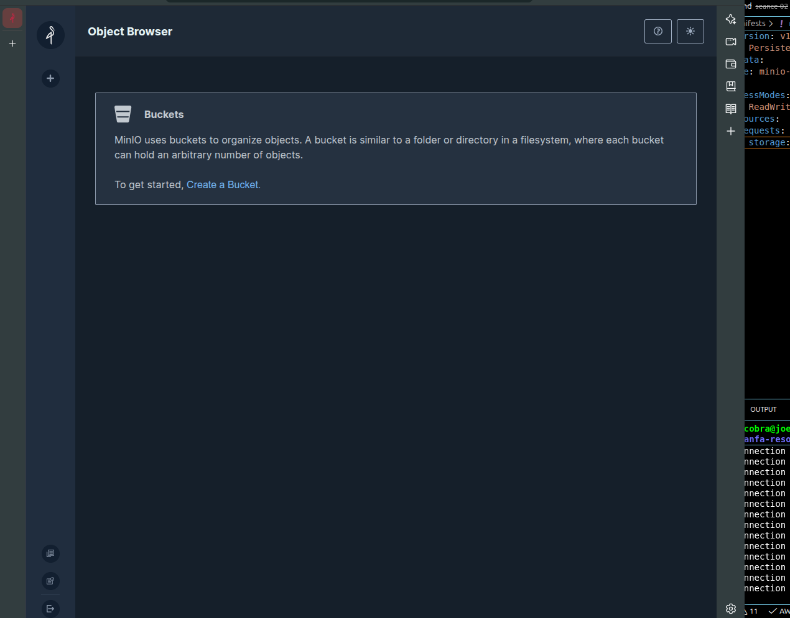
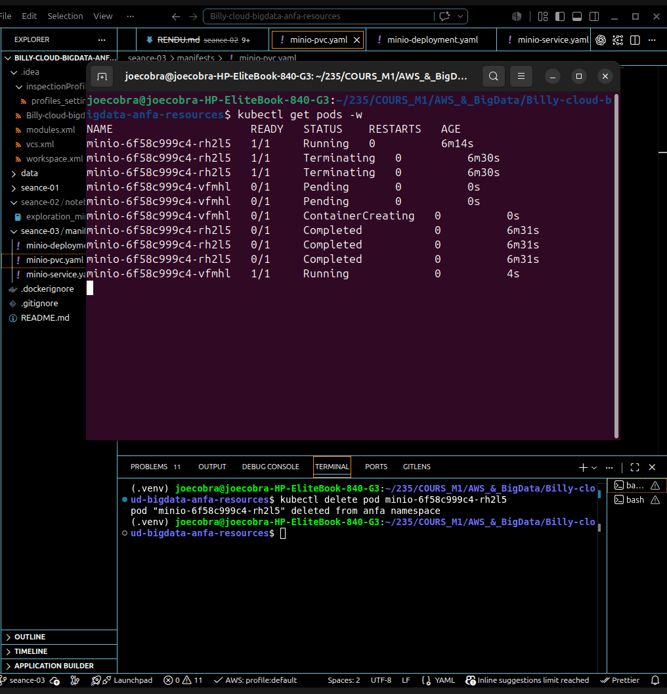
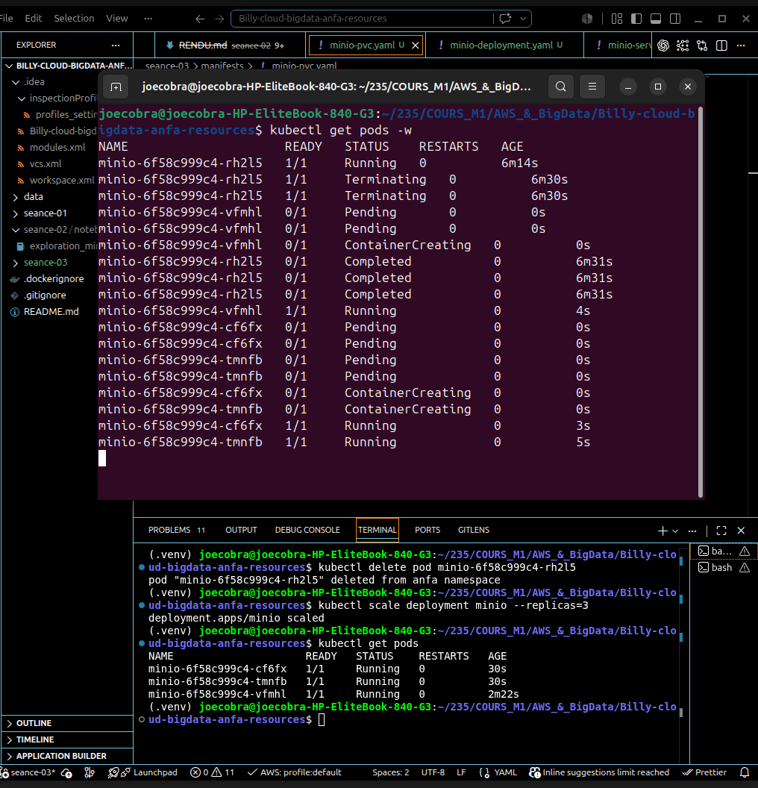

# Rendu Séance 3

**Nom :** 
# Ngartobaye Oumarou Billy

---

# Résumé de la séance

L'objectif de cette séance était la découverte de **Kubernetes** à travers **Kind (Kubernetes in Docker)**. Nous avons déployé **MinIO** sur un cluster Kubernetes local en manipulant les principaux objets Kubernetes :

- Pod
- Deployment
- Service
- PersistentVolumeClaim (PVC)

Nous avons également observé les mécanismes d'auto-guérison (Self-Healing), de mise à l'échelle (Scaling) et de gestion déclarative de Kubernetes.

---

# Exercice 1 : QCM conceptuel

### 1.1
**Réponse : B**

Kubernetes orchestre des conteneurs en s'appuyant sur un **Container Runtime (CRI)**.

### 1.2
**Réponse : B**

`etcd` est la base de données clé-valeur qui stocke l'état complet du cluster.

### 1.3
**Réponse : C**

Le **Scheduler** décide sur quel nœud un nouveau Pod doit être placé.

### 1.4
**Réponse : C**

L'**API Server** est le point d'entrée unique de toutes les requêtes du cluster.

### 1.5
**Réponse : B**

Le **Deployment** réconcilie l'état réel avec l'état souhaité et recrée automatiquement un Pod supprimé.

### 1.6
**Réponse : B**

Le **NodePort** expose un Service sur un port spécifique de chaque nœud du cluster.

### 1.7
**Réponse : B**

Le **Deployment** modifie l'état souhaité et Kubernetes fait converger automatiquement le système.

### 1.8
**Réponse : B**

Les **Namespaces** permettent d'isoler logiquement les ressources (équipes, projets, environnements).

### 1.9
**Réponse : B**

Avec **Kind**, les nœuds Kubernetes tournent à l'intérieur de conteneurs Docker.

---

# Exercice 2 : Lecture et interprétation d'un manifeste

## 2.1

`selector.matchLabels` identifie les Pods que le Deployment doit gérer. Les labels doivent correspondre à ceux définis dans :

```yaml
template:
  metadata:
    labels:
```

---

## 2.2

Deux Pods seront créés.

Si l'un des Pods est supprimé ou tombe en panne, le **Deployment** en crée automatiquement un nouveau afin de maintenir le nombre de répliques demandé.

---

## 2.3

Le nom du Service est :

```
minio
```

Grâce au DNS interne de Kubernetes, les autres Pods peuvent joindre MinIO avec :

```
http://minio:9000
```

---

## 2.4

Si le Service est de type **ClusterIP**, alors l'API est uniquement accessible :

- depuis le cluster ;
- elle n'est pas accessible directement depuis l'extérieur.

---

## 2.5

```yaml
apiVersion: v1
kind: Service
metadata:
  name: anfa-api-service

spec:
  selector:
    app: anfa-api

  ports:
    - port: 80
      targetPort: 8000
```

---

# Exercice 3 : Diagnostic

## 3.1 ImagePullBackOff

### a)

Erreur lors du téléchargement de l'image Docker.

### b)

Le plus souvent :

- mauvais nom de l'image ;
- mauvais tag.

### c)

Commande de diagnostic :

```bash
kubectl describe pod <nom>
```

---

## 3.2 PVC Pending

### a)

Le PVC attend un volume disponible.

### b)

Aucun **PersistentVolume (PV)** ne correspond à la demande.

### c)

Commande :

```bash
kubectl describe pvc data-pvc
```

---

## 3.3 Pod en état Pending

### a)

Le Pod n'est pas encore en état **Running**.

### b)

Commande :

```bash
kubectl describe pod <nom>
```

### c)

Attendre que le Pod passe à l'état :

```
Running
```

---

# Exercice 4 : De Docker Compose à Kubernetes

## 4.1

Les trois objets Kubernetes principaux sont :

- Deployment
- Service
- PersistentVolumeClaim (PVC)

---

## 4.2

Un volume Docker est directement géré par l'hôte.

Un **PersistentVolumeClaim (PVC)** représente une demande abstraite de stockage qui sera satisfaite par Kubernetes.

---

## 4.3

Avec Kind, le cluster est isolé dans Docker.

Pour exposer correctement un service sur la machine hôte, il faudrait utiliser un **LoadBalancer**, par exemple avec **MetalLB**.

---

## 4.4

Deux avantages importants de Kubernetes :

1. Auto-guérison (Self-Healing)
2. Rolling Update (mise à jour sans interruption)

---

# Exercice 5 : Mini-cas d'architecture

## 5.1

### pipeline-anfa

Utiliser un **CronJob** car il s'agit d'une tâche planifiée.

### anfa-api

Utiliser un **Deployment** afin d'assurer la haute disponibilité.

### anfa-dashboard

Utiliser également un **Deployment**.

---

## 5.2

Configuration recommandée du HPA :

- minReplicas : 2
- maxReplicas : 10
- cible CPU : 60 %

Cela permet :

- une haute disponibilité ;
- une montée en charge automatique.

---

## 5.3

Le type de Service recommandé est :

```
LoadBalancer
```

Il permet d'exposer publiquement l'application via une adresse IP fournie par le fournisseur Cloud.

---

## 5.4

Le déploiement d'une nouvelle version se fait grâce à la stratégie :

```
RollingUpdate
```

Les anciens Pods sont remplacés progressivement par les nouveaux sans interruption de service.

---

## 5.5

```yaml
apiVersion: apps/v1
kind: Deployment

metadata:
  name: anfa-api

spec:
  replicas: 3

  selector:
    matchLabels:
      app: anfa-api

  template:
    metadata:
      labels:
        app: anfa-api

    spec:
      containers:
        - name: api
          image: anfa/api:v1

          ports:
            - containerPort: 8000

          env:
            - name: MINIO_ENDPOINT
              value: "http://minio:9000"
```

---

# Captures d'écran



### Console MinIO



### Auto-guérison



### Scaling 3 replicas