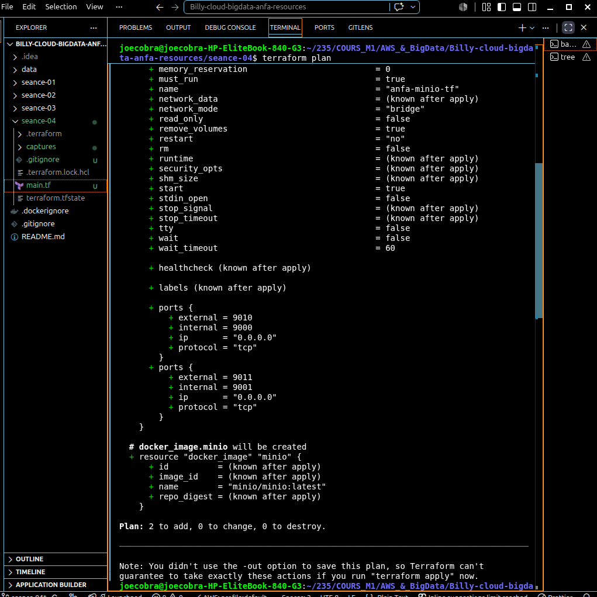
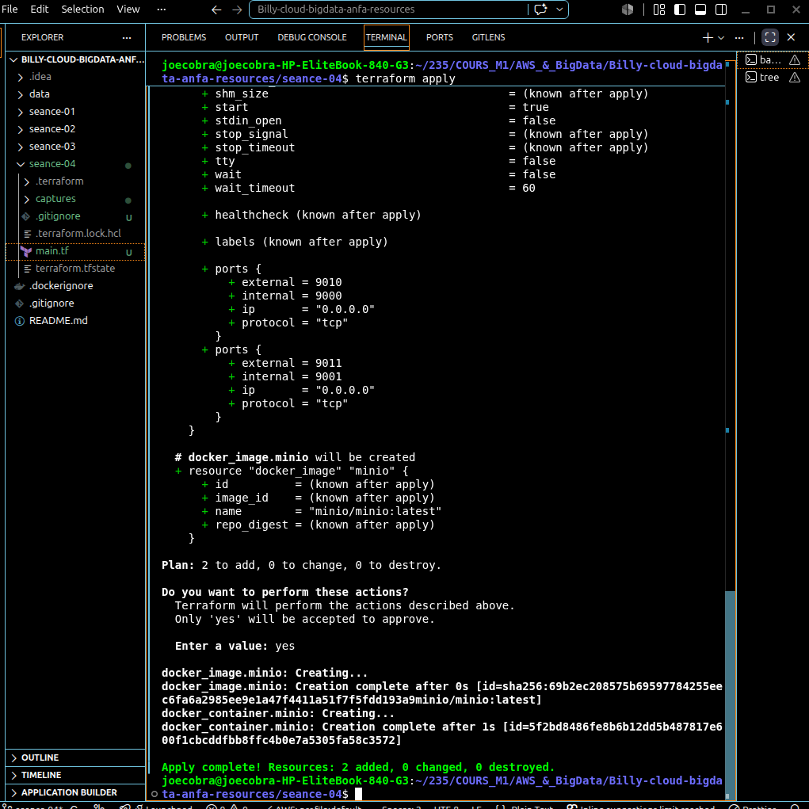
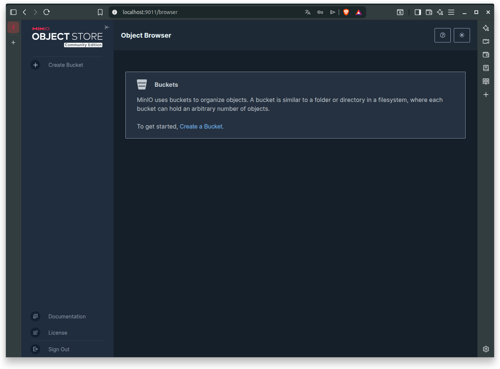
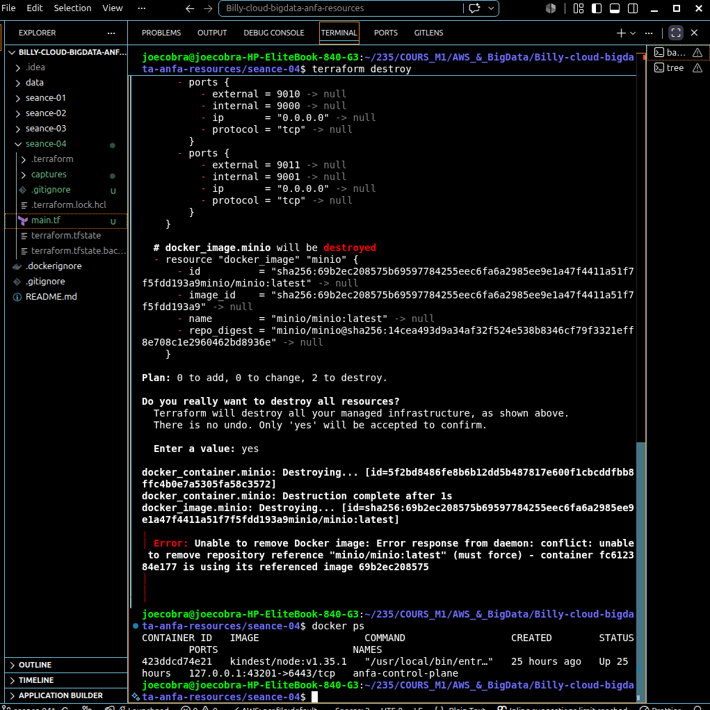

# Rendu Séance 4 - Infrastructure as Code avec Terraform

## Résumé de la séance
L'objectif était d'automatiser le déploiement de l'infrastructure Docker via Terraform. Nous avons appris à gérer le cycle de vie complet (init, plan, apply, destroy) et à industrialiser le code en utilisant des variables et une gestion sécurisée des secrets.

## Étapes accomplies
1. **Initialisation** : Installation de Terraform et configuration du provider Docker.
2. **Infrastructure** : Création d'un réseau, d'un volume persistant et du conteneur MinIO.
3. **Paramétrage** : Refactoring pour utiliser `variables.tf` et isoler les secrets dans `terraform.tfvars`.
4. **Idempotence** : Vérification que Terraform ne recrée pas les ressources inutilement.

## Captures d'écran

- `terraform-plan.png` : Vérification du plan avant déploiement.

- `terraform-apply.png` : Déploiement réussi de la stack.

- `console-minio-tf.png` : Accès à l'interface de gestion MinIO.

- `terraform-destroy.png` : Nettoyage propre de l'infrastructure.

## Réponses aux questions (optionnel du TP)
* **Pourquoi ne pas commit le .tfstate ?** Parce qu'il contient des informations sensibles en clair sur les ressources (mots de passe, adresses IP).
* **Utilité des variables ?** Elles permettent de rendre le code réutilisable (ex: changer le port ou le nom du conteneur) sans modifier le cœur de la logique métier.

