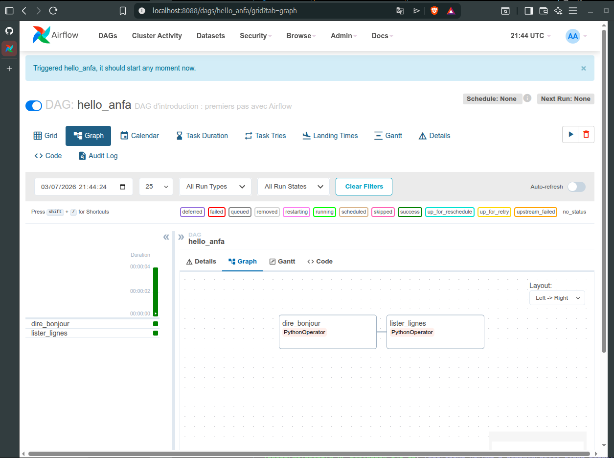
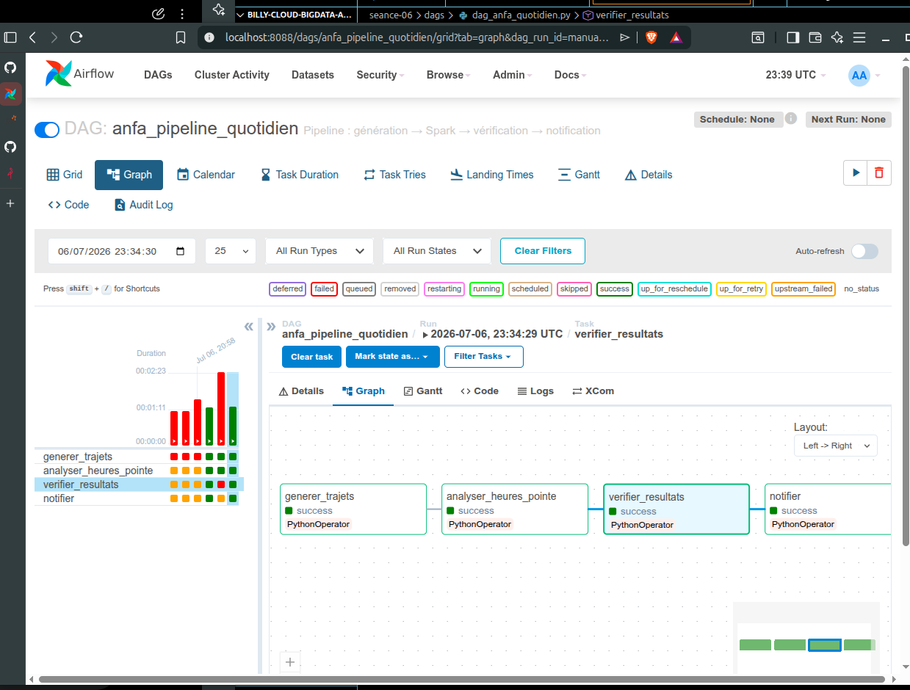
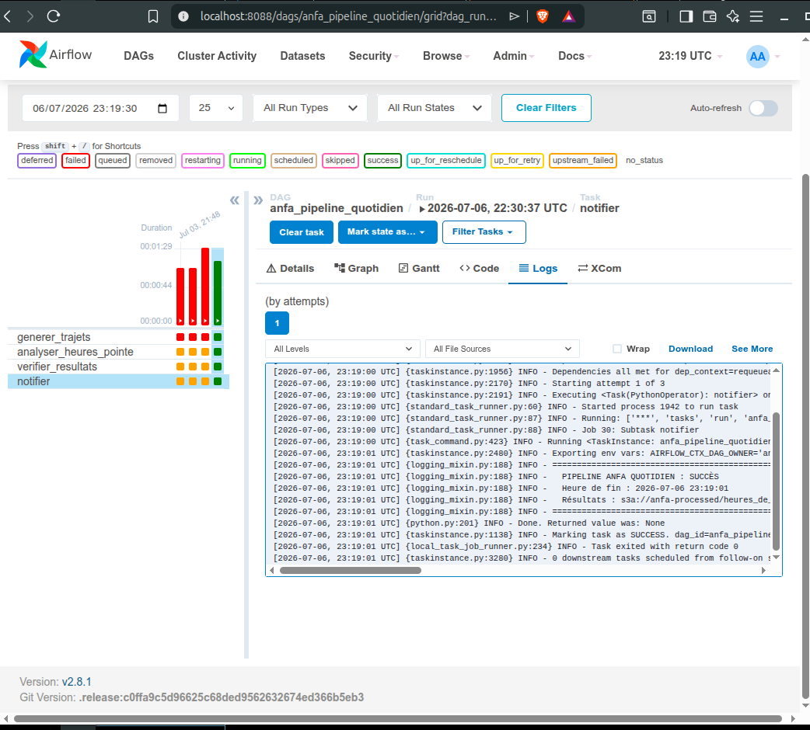
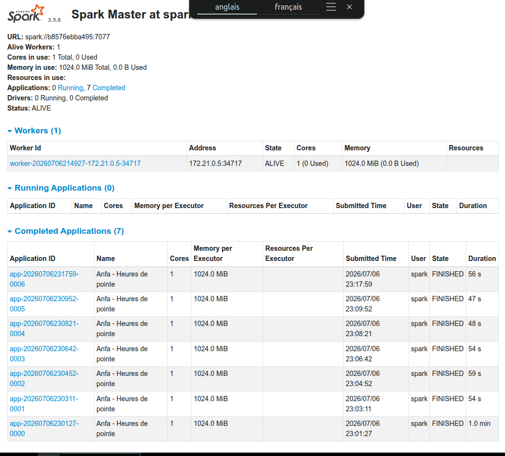
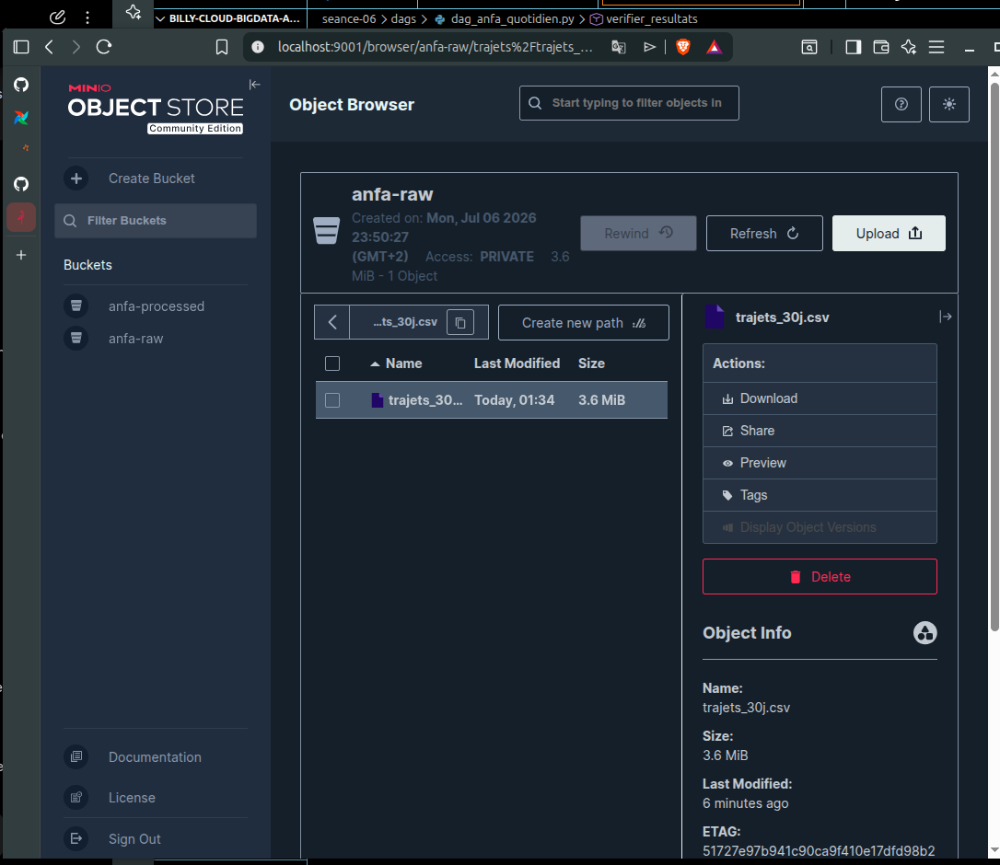
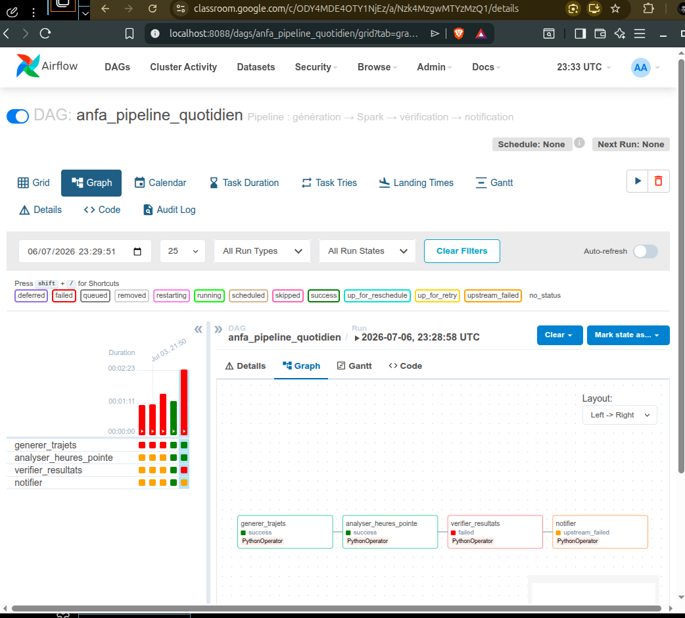
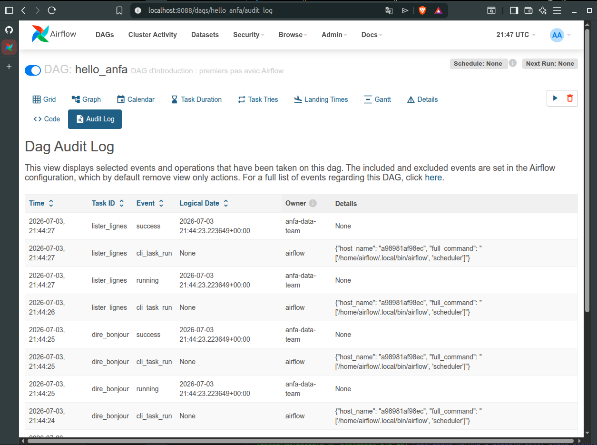

# Rendu TP : Séance 06 - Orchestration avec Apache Airflow

**Étudiant :** NGARTOBAYE OUMAROU BILLY
**Cours :** AWS & Big Data
**Date :** 06 Juillet 2026

---

# Objectifs de la séance

L'objectif principal de cette séance était de déployer et configurer **Apache Airflow** afin d'orchestrer un pipeline complet de traitement de données pour l'entreprise fictive **Anfa**.

Les principaux objectifs étaient les suivants :

* Déployer un environnement Airflow fonctionnel avec Docker Compose.
* Orchestrer un pipeline complet :

  * Génération des données.
  * Traitement avec Apache Spark.
  * Vérification des résultats.
  * Notification de fin d'exécution.
* Assurer la communication entre les différents services (Airflow, Spark et MinIO).
* Mettre en place des mécanismes de résilience grâce aux **retries** d'Airflow.

---

# Déploiement et configuration

L'ensemble de la plateforme a été déployé à l'aide de :

```bash
docker-compose up -d
```

Le principal défi rencontré concernait la communication entre **Apache Airflow** et le cluster **Spark** via le socket Docker.

Une configuration appropriée des permissions du socket Docker sur le système hôte a été nécessaire afin de permettre l'exécution des commandes `spark-submit` depuis Airflow.

## Configuration de MinIO

Les opérations suivantes ont été réalisées :

* création de l'alias MinIO ;
* configuration des identifiants d'accès ;
* attribution des permissions **readwrite** au bucket utilisé par l'application.

## Intégration avec Apache Spark

Les traitements Spark sont lancés directement depuis Airflow à l'aide de la commande :

```bash
spark-submit
```

Cette commande est exécutée à l'intérieur du conteneur :

```
anfa-spark-master
```

---

# Captures d'écran

## 1. Test initial : Hello Airflow



Cette capture montre le premier DAG exécuté avec succès afin de vérifier le bon fonctionnement d'Apache Airflow.

---

## 2. Pipeline métier complet



Cette capture présente l'exécution complète du pipeline :

* génération des données ;
* traitement Spark ;
* vérification des résultats ;
* notification finale.

---

## 3. Vue des DAGs exécutés avec succès



L'ensemble des tâches du DAG est terminé avec succès.

---

## 4. Monitoring Apache Spark



Cette capture montre l'interface Web de Spark disponible sur :

```
http://localhost:8090
```

Elle permet de suivre les jobs Spark en cours d'exécution ainsi que leur historique.

---

## 5. Vérification des résultats dans MinIO



Les fichiers générés par le traitement Spark sont correctement présents dans le bucket **anfa-processed**.

---

# Résilience et débogage

Afin de tester la robustesse du pipeline, une erreur volontaire a été introduite dans la tâche :

```
verifier_resultats
```

---

## Échec du DAG



Cette capture montre l'état du DAG lorsqu'une tâche échoue.

---

## Analyse des logs



Les journaux d'exécution permettent d'identifier précisément l'origine de l'erreur.

Airflow applique automatiquement la politique de **retries** définie dans les `default_args` du DAG avant de déclarer définitivement l'échec de la tâche.

---

# Conclusion

Cette séance a permis de comprendre le rôle essentiel d'**Apache Airflow** dans l'orchestration de pipelines de données distribués.

Les principaux acquis sont :

* déploiement d'Airflow avec Docker Compose ;
* orchestration d'un pipeline complet de traitement de données ;
* intégration entre Airflow, Apache Spark et MinIO ;
* utilisation des mécanismes de résilience (`retries`) pour améliorer la fiabilité des traitements ;
* compréhension de l'importance de l'idempotence des tâches, notamment grâce au mode `overwrite` utilisé lors des écritures Spark.

Cette architecture démontre la capacité d'Airflow à coordonner efficacement plusieurs services distribués tout en assurant le suivi, la supervision et la reprise automatique des traitements en cas d'erreur.

---

