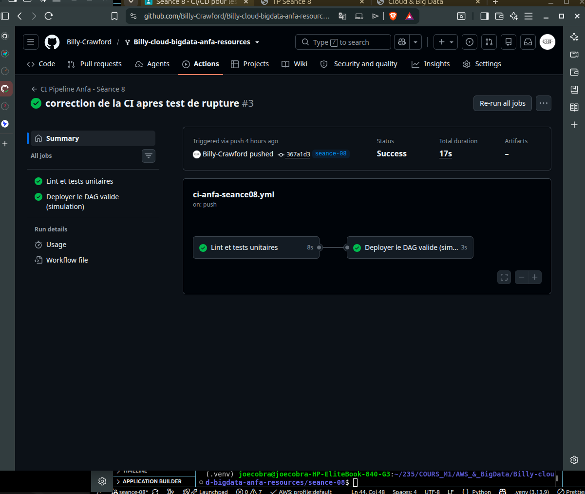
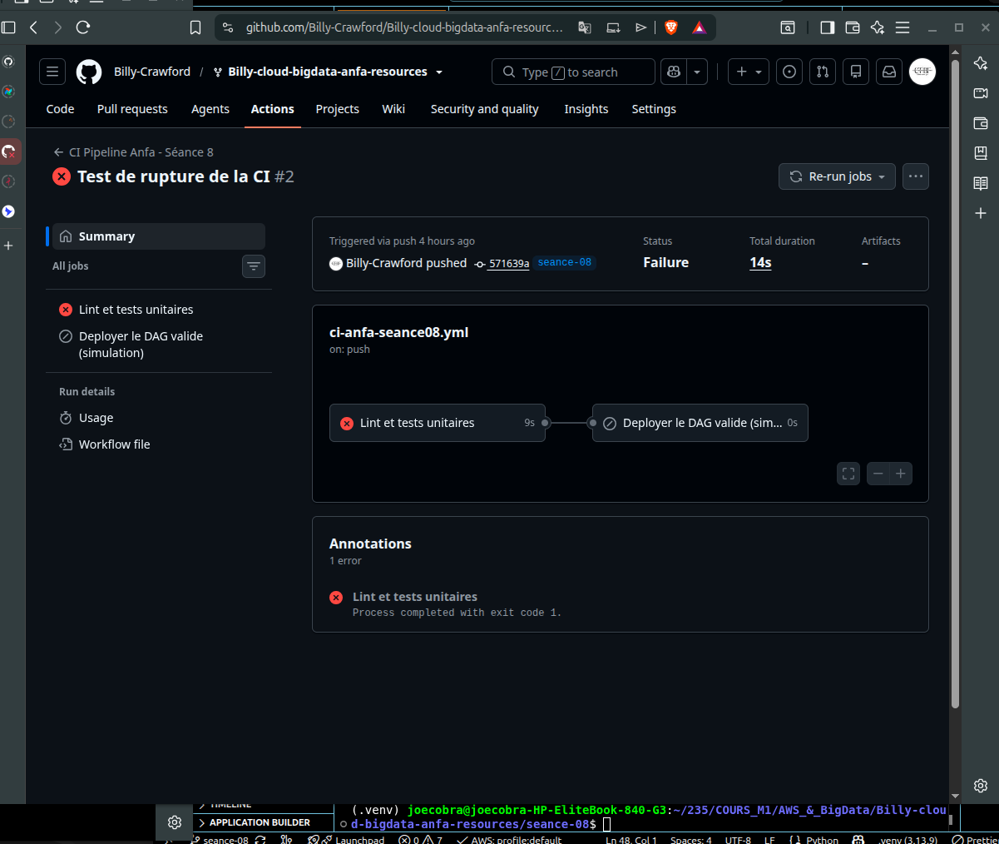

# Rendu — Séance 8

**Nom et prénom :** OUMAROU BILLY N.

**Identifiant GitHub :** Billy-Crawford

**Date de soumission :** 07/07/2026

## Résumé de la séance

Lors de cette séance, nous avons professionnalisé notre pipeline de données en extrayant la logique métier du DAG Airflow pour la rendre testable. Nous avons mis en place un workflow GitHub Actions automatisant la qualité du code (lint) et la validation par tests unitaires (pytest), permettant de garantir la fiabilité du déploiement à chaque modification.

## Étapes principales

1. Séparation de la logique métier (`anfa_logic.py`) du DAG Airflow.
2. Écriture de 5 tests unitaires avec pytest.
3. Écriture du workflow GitHub Actions (lint + tests + déploiement simulé).
4. Démonstration : un bug volontaire bloque le déploiement ; correction et succès.

## Captures d'écran

### Workflow réussi (2 jobs)

### Job en échec, déploiement non exécuté

## Réflexion personnelle

Ce pipeline aurait empêché l'incident de Mawuli en stoppant immédiatement la mise en production dès la détection de l'erreur dans la logique de calcul par les tests unitaires automatisés. La directive needs: valider-dag est cruciale ici : elle établit une dépendance stricte, garantissant que le job de déploiement ne s'exécute jamais si les tests ne sont pas passés avec succès (statut vert), protégeant ainsi l'environnement de production contre les régressions.

## Difficultés rencontrées

Configuration initiale du workflow : Le dossier .github/workflows devait être impérativement à la racine du dépôt pour être détecté par GitHub Actions.

Environnement local : Nécessité d'installer les dépendances du fichier requirements.txt dans le .venv pour permettre l'exécution correcte de pytest en local.

