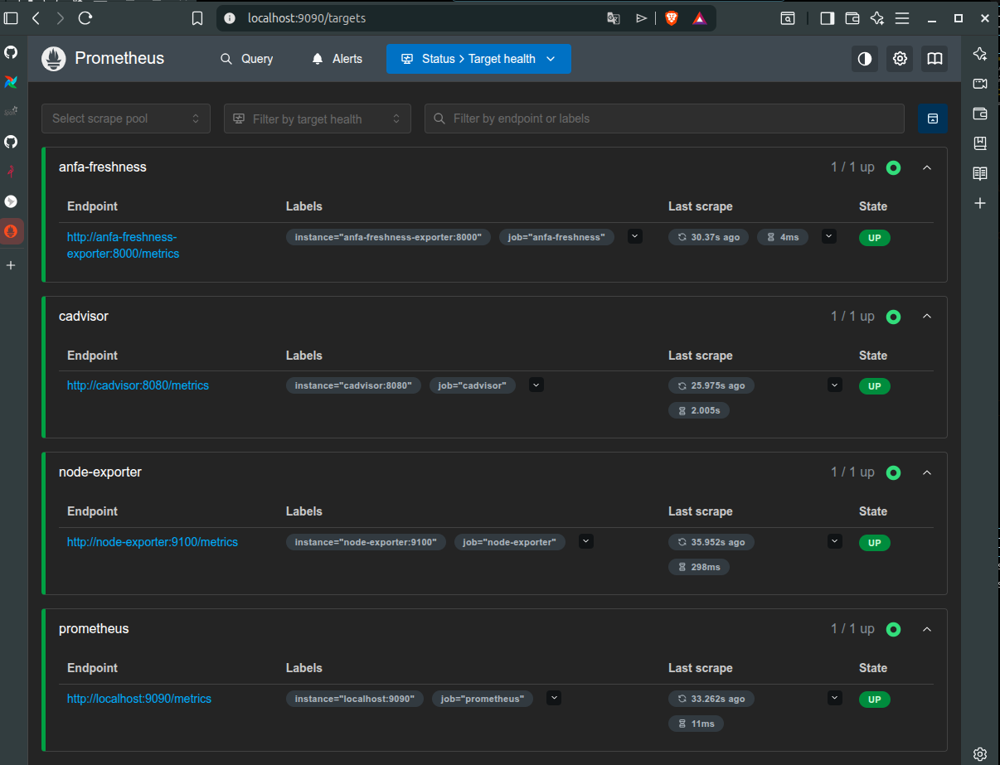
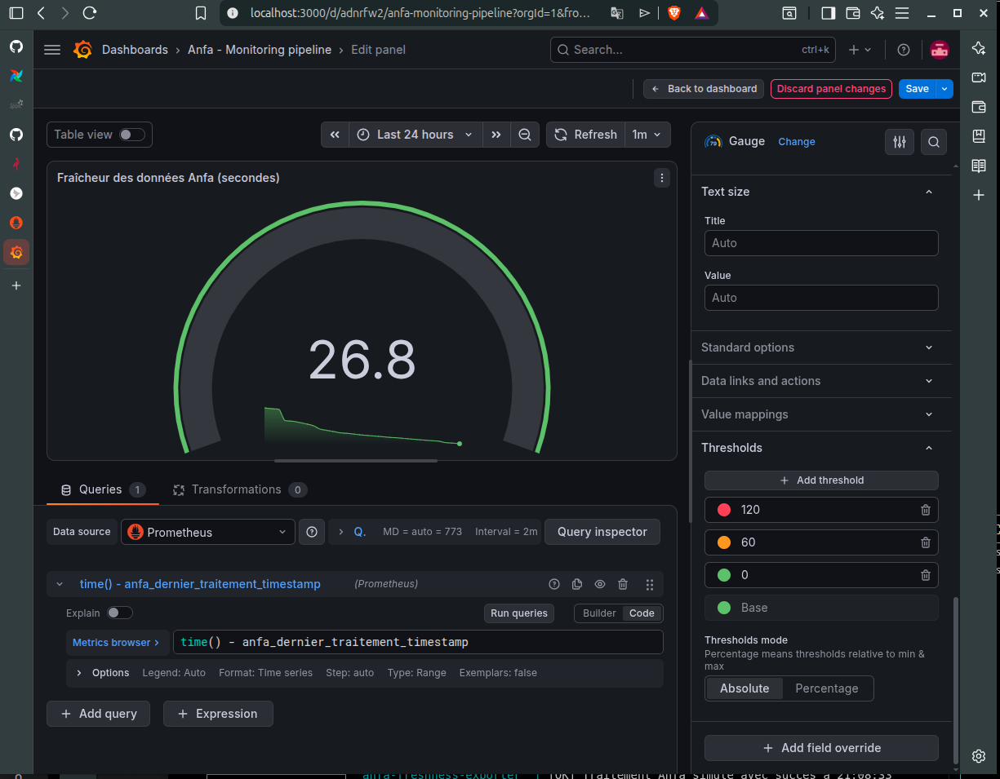
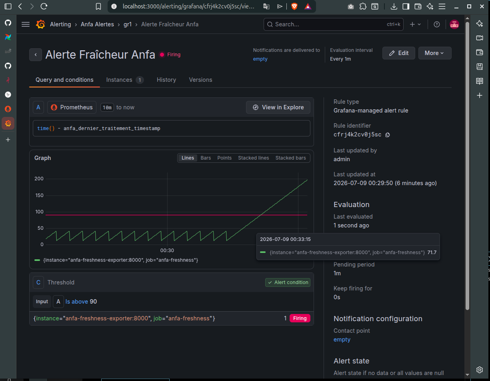

# Rendu — Séance 9

**Nom et prénom :** OUMAROU BILLY

**Identifiant GitHub :** Billy-Crawford

**Date de soumission :** 08/07/2026

## Résumé de la séance

Lors de cette séance, nous avons déployé une stack de monitoring complète avec Prometheus et Grafana. Nous avons instrumenté un exportateur métier pour suivre la fraîcheur des données Anfa, construit un dashboard personnalisé, et configuré une règle d'alerte spécifique qui s'est déclenchée avec succès lors de la simulation d'une panne silencieuse du pipeline.

## Étapes principales

1. Déploiement de Prometheus, Node Exporter, cAdvisor, Grafana et d'un exportateur métier custom (fraîcheur des données Anfa).
2. Exploration des cibles Prometheus et premières requêtes PromQL.
3. Import du dashboard "Node Exporter Full" et construction d'un panneau custom.
4. Configuration d'une alerte Grafana sur la fraîcheur des données.
5. Simulation d'une panne silencieuse et observation du déclenchement de l'alerte.

## Captures d'écran

### Les cibles Prometheus à l'état UP

### Dashboard "Anfa - Monitoring pipeline" avec la jauge

### Alerte à l'état Firing après panne simulée

## Réflexion personnelle

Cette séance répond directement à la situation d'Awa en mettant en place une surveillance centrée sur le métier et non seulement sur l'infrastructure. Contrairement aux métriques classiques (CPU, RAM, statut des conteneurs) qui indiquaient que le conteneur était "UP", la métrique de fraîcheur a permis de révéler une panne silencieuse : le processus tournait mais ne traitait plus de données. Cela démontre l'importance critique de définir des indicateurs de santé fonctionnels pour garantir la continuité du service.

## Difficultés rencontrées

J'ai rencontré quelques difficultés lors de la configuration initiale de l'alerte via l'interface, notamment pour localiser l'onglet "Alert" qui a évolué dans la version actuelle de Grafana. L'utilisation du menu latéral "Alerting" a permis de résoudre ce point et de finaliser la configuration.